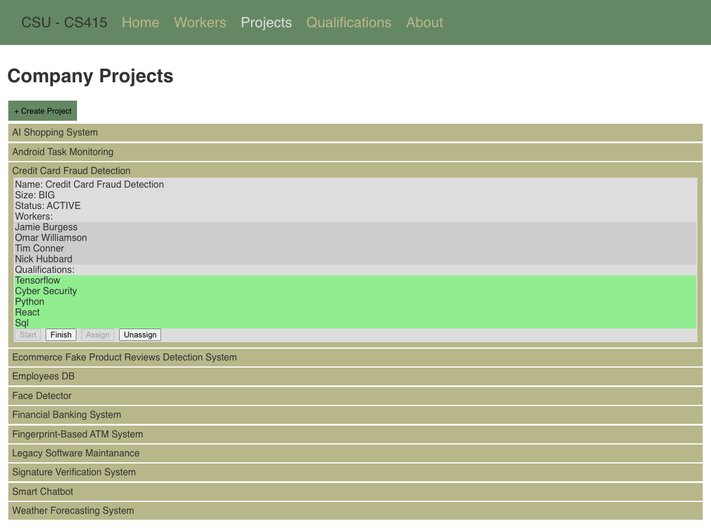
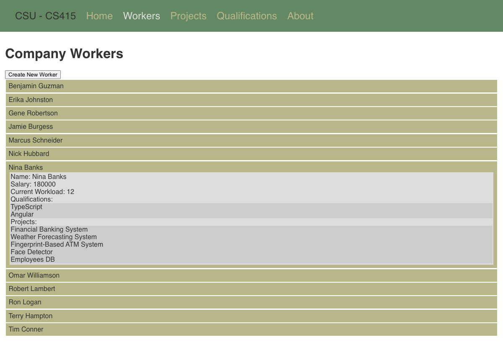
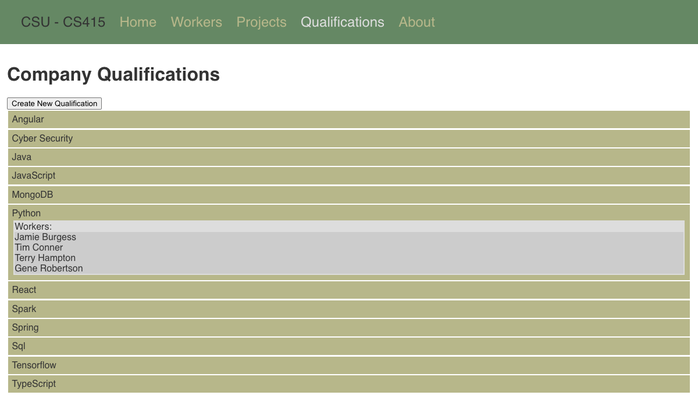

# Company Management

A web app for managing a company's workers, projects, and the qualifications that connect them. It has a Java REST server and a React client. We built it as a team project for CS415 (Software Testing) at Colorado State University in Spring 2026, so most of the work went into testing the domain model: input space partitioning, coverage and mutation analysis, automated test generation, static analysis, and use-case-driven UI tests.



## Features

- Browse workers, projects, and qualifications, and expand any entry to see its details.
- Create new workers (with qualifications and salary), projects (with size and required qualifications), and qualifications.
- Assign workers to projects and unassign them. The server enforces the business rules: a worker must be available, must have a qualification the project still needs, and must not go over their workload limit. Workers can't be added to an active or finished project.
- Start and finish projects as they move through the planned, active, suspended, and finished states.
- See each worker's salary, current workload, qualifications, and projects.

<p>
  
  
</p>

## Tech stack

**Server:** Java 8, Spark, Gson, Maven<br>
**Client:** React 18<br>
**Testing:** JUnit 4, Mockito, JaCoCo, PIT, EvoSuite, Randoop, PMD, SpotBugs, GitHub Actions

## Testing

CI runs the full suite and PIT mutation testing on every push.

| Area | What we did | Write-up |
| --- | --- | --- |
| Input space partitioning | Partitioned the inputs of each model method, derived base-choice coverage tests, and mapped each test row to a JUnit test | [P1_ISP.md](docs/testing/P1_ISP.md) |
| Code coverage | JaCoCo instruction and branch coverage for every model class | [P1_coverage.md](docs/testing/P1_coverage.md) |
| Mutation testing | PIT reached 98% mutation coverage over the model (145/148 mutants killed) | [P2_mutation.md](docs/testing/P2_mutation.md) |
| Automated test generation | Generated regression suites with EvoSuite and Randoop and compared them with the hand-written tests | [P2_atg.md](docs/testing/P2_atg.md) |
| Static analysis | Found issues with PMD and SpotBugs, then refactored to resolve them | [P2_sa.md](docs/testing/P2_sa.md) |
| Use cases and UI tests | Wrote a use case for each UI feature, then derived workflow test cases from them | [P3_UseCases.md](docs/testing/P3_UseCases.md), [P3_TestCases.md](docs/testing/P3_TestCases.md) |

## Running locally

**Prerequisites:** JDK 8, Maven, and Node.js 18 or newer.

**Server** (port 4567):

```sh
cd server
mvn exec:exec
```

**Client** (port 3000, in a second terminal):

```sh
cd client
npm install
npm start
```

Then open http://localhost:3000. On startup the server loads a sample company with 12 workers, 12 projects, and 12 qualifications.

**Tests:**

```sh
cd server
mvn test                                                   # all tests + JaCoCo report in target/site/jacoco
mvn test-compile org.pitest:pitest-maven:mutationCoverage  # PIT report in target/pit-reports
```

The EvoSuite-generated tests need a Java 8 runtime.

## REST API

All endpoints are under `http://localhost:4567/api`.

| Method | Path | Description |
| --- | --- | --- |
| GET | `/qualifications`, `/qualifications/:description` | List qualifications, or get one |
| POST | `/qualifications/:description` | Create a qualification |
| GET | `/workers`, `/workers/:name` | List workers, or get one |
| POST | `/workers/:name` | Create a worker |
| GET | `/projects`, `/projects/:name` | List projects, or get one |
| POST | `/projects/:name` | Create a project |
| PUT | `/assign`, `/unassign` | Add a worker to a project, or remove one |
| PUT | `/start`, `/finish` | Change a project's status |

## Project layout

```
server/        Spark REST API, domain model (Company, Worker, Project, Qualification), tests
  tools/       EvoSuite and Randoop jars used to generate tests
client/        React single-page app
docs/testing/  Testing reports from each sprint
```

## Acknowledgments

The CS415 course staff provided the starter code: the project skeleton, DTOs, sample data, stubbed model classes, the server scaffolding, and the client shell. Our team implemented the domain model, the REST endpoints, the client features, and all of the tests and reports.
